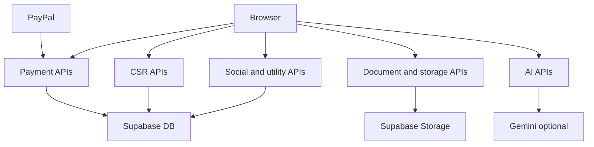

# API Overview

API routes live under `app/api`. They are used when a browser or external provider needs an HTTP endpoint rather than a server action.

## API Groups

- [Payments](payments.md)
- [CSR](csr.md)
- [AI](ai.md)
- [Documents and storage](documents-and-storage.md)
- [Social and utility](social-and-utility.md)

## Route Rules

- Validate session where required.
- Validate email verification for sensitive actions.
- Validate request origin for mutation routes that need CSRF protection.
- Rate-limit payment and sensitive routes.
- Use server-only clients for privileged work.
- Do not trust client-provided money values without server-side checks.
