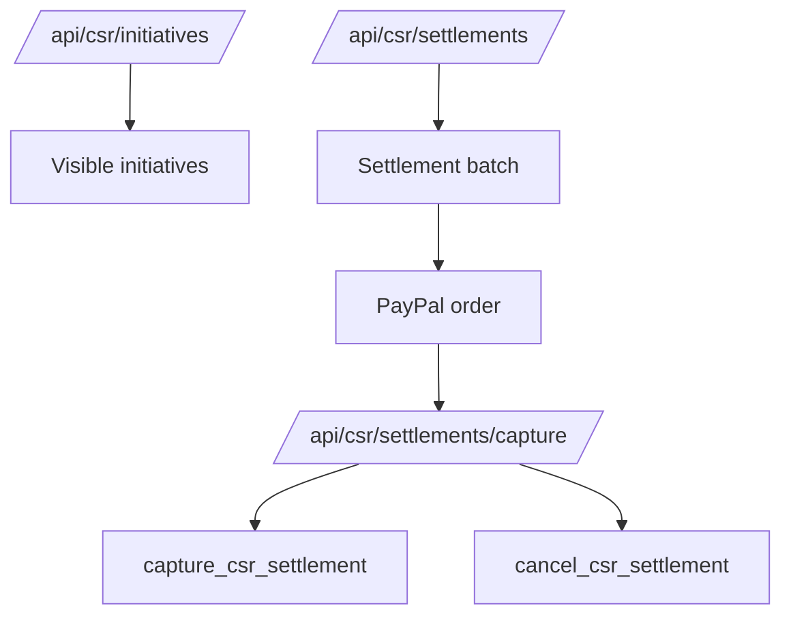

# CSR APIs

## `/api/csr/initiatives`

Returns CSR initiatives visible to the current corporate employee or owner.

## `/api/csr/settlements`

Creates a CSR settlement batch and PayPal order.

Responsibilities:

- Check corporate profile ownership.
- Validate selected outstanding pledges.
- Call `create_csr_settlement_batch`.
- Create PayPal order.
- Return approval information.

## `/api/csr/settlements/capture`

Captures a CSR settlement PayPal order.

Responsibilities:

- Require POST.
- Validate same-origin request.
- Apply payment rate limit.
- Check corporate ownership.
- Capture PayPal order.
- Validate provider totals.
- Call `capture_csr_settlement`.
- Cancel settlement if requested.
