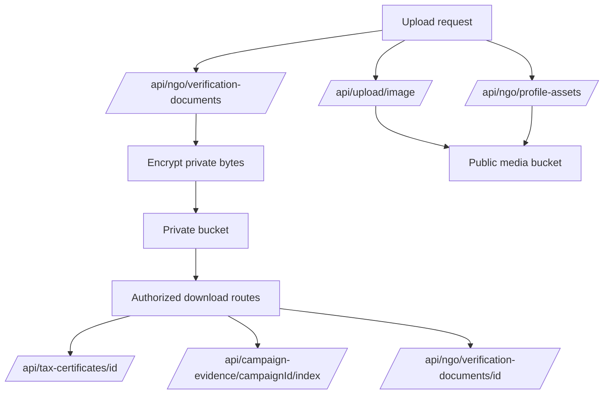

# Document and Storage APIs

## `/api/upload/image`

Uploads community media to the fixed `community-media` bucket.

## `/api/ngo/profile-assets`

Handles NGO profile asset uploads such as logo and cover.

## `/api/ngo/verification-documents`

Handles private NGO verification document upload and deletion.

## `/api/ngo/verification-documents/[id]`

Serves a private NGO verification document to authorized users.

## `/api/campaign-evidence/[campaignId]/[index]`

Serves private campaign evidence to authorized users, usually admins or owners.

## `/api/tax-certificates/[id]`

Serves private tax certificate documents to authorized users.

## `/api/receipts/[id]`

Serves an app-level donation receipt to the allowed donor or admin.

## `/api/volunteer-certificates/[id]`

Returns a volunteer certificate PDF for an authorized participant.
