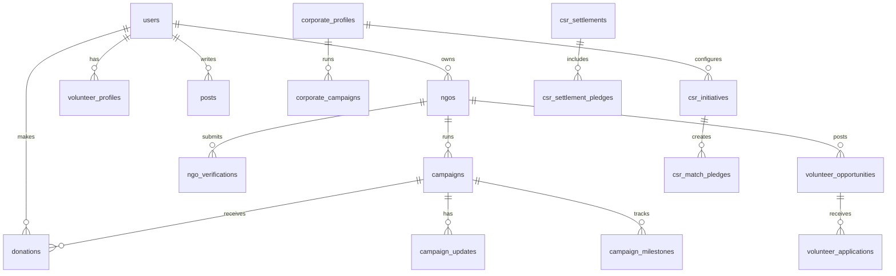

# Database Architecture

Supabase PostgreSQL stores the application data. Migrations in `supabase/migrations/` are the source of truth.



## Major Table Groups

### Identity and profiles

- `users`
- `user_profiles`
- `volunteer_profiles`
- `corporate_profiles`
- `ngos`

### NGO verification and public content

- `ngo_verifications`
- `ngo_verification_documents`
- `ngo_programs`
- `ngo_updates`
- `ngo_gallery_images`
- `ngo_service_areas`
- `ngo_reviews`

### Campaigns and giving

- `campaigns`
- `campaign_updates`
- `campaign_milestones`
- `donations`
- `payment_orders`
- `payment_events`
- `subscriptions`
- `subscription_invoices`
- `refund_requests`
- `payment_transfers`
- `payout_accounts`

### Tax and documents

- `donor_tax_profiles`
- `tax_certificates`

### Volunteering

- `volunteer_opportunities`
- `volunteer_applications`
- `volunteer_hours`
- `skill_verifications`
- `volunteer_certificates`

### Community

- `posts`
- `post_likes`
- `post_comments`
- `post_bookmarks`
- `post_views`
- `follows`
- `content_reports`
- `moderation_actions`

### Corporate CSR

- `corporate_employees`
- `corporate_invitations`
- `corporate_campaigns`
- `partnership_requests`
- `csr_initiatives`
- `csr_match_pledges`
- `csr_settlements`
- `csr_settlement_pledges`

### Operations

- `notifications`
- `activity_logs`
- `analytics_logs`
- `audit_logs`
- `ai_flags`
- `action_rate_limits`
- `email_queue`

## Money Model

Application money values use integer paise fields such as:

- `amount_paise`
- `target_paise`
- `goal_paise`
- `raised_paise`
- `refunded_paise`
- `matched_paise`
- `cap_paise`

Avoid float money values.

## RLS

Sensitive tables use Row Level Security. RLS should protect:

- Ownership.
- Public visibility.
- Admin-only records.
- Private documents.
- Internal payment tables.

Server-side checks are still required. RLS is not a replacement for validation.

## Migrations

Migrations are numeric and should be applied in order.

Current migration range:

- `006_platform_baseline.sql` through `041_normalize_money_and_public_profiles.sql`

Use:

```bash
npm run db:migrate:dry
npm run db:push
npm run db:types
```
