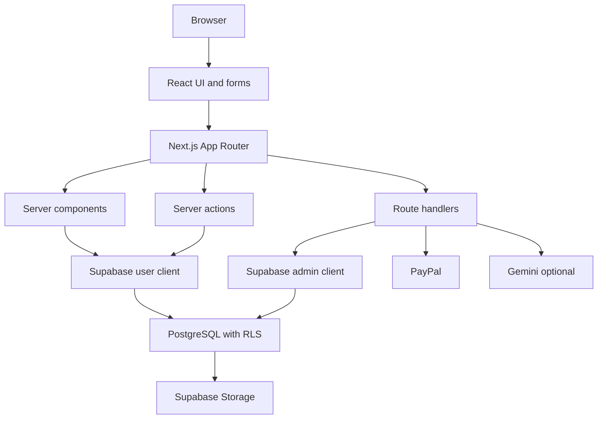

# Architecture Overview

DaanSetu is a Next.js App Router application using Supabase as the active backend boundary.



## High-Level Shape

```text
Browser
  |
  | React pages, forms, client components
  v
Next.js App Router
  |
  | Server components, server actions, route handlers
  v
Supabase
  |
  | Auth, PostgreSQL, Storage, Realtime, RLS
  v
External providers
  |
  | PayPal, Gemini
```

## Main Layers

### App routes

`app/` contains pages, route handlers, and server actions. Pages are grouped by product area: public discovery, dashboard, NGO, corporate, volunteer, admin, API, auth, and community.

### Components

`components/` contains shared UI and domain-specific UI components.

### Domain and services

`lib/domain/` contains business helpers that do not directly own UI. `lib/services/` contains server-side service functions for analytics, posts, notifications, leaderboard, campaigns, and related areas.

### Supabase clients

`lib/supabase/server.ts` creates a cookie-aware server client. `lib/supabase/admin.ts` creates a server-only service-role client.

### Migrations

`supabase/migrations/` is the schema source. Migrations create tables, RLS policies, indexes, RPCs, storage policies, and cleanup rules.

### Tests

`tests/` contains contract-style tests that protect major workflows.

## Main Architectural Rules

- Use server actions or route handlers for mutations.
- Use RLS and server-side checks together.
- Use service-role access only in server-only modules.
- Keep payment, refund, payout, tax, and admin decisions atomic.
- Store money as integer paise.
- Keep private documents behind authenticated routes.
- Keep AI optional and fallback-safe.
