# Feature Index

The feature docs describe what the application does from a product point of view, while still pointing to the real routes and system boundaries.

```mermaid
flowchart TD
  Features[DaanSetu features] --> Public[Public discovery]
  Features --> Supporters[Supporters]
  Features --> NGOs[NGOs]
  Features --> Corporate[Corporate CSR]
  Features --> Community[Community]
  Features --> Admin[Admin]
  Public --> PublicNGOs[NGOs]
  Public --> PublicCampaigns[Campaigns]
  Public --> Impact[Impact and leaderboards]
  Supporters --> Giving[Giving, refunds, receipts]
  Supporters --> SupporterVolunteering[Volunteering]
  NGOs --> Verification[Verification]
  NGOs --> NGOCampaigns[Campaigns and volunteers]
  NGOs --> Payouts[Payouts and tax]
  Corporate --> Employees[Employees]
  Corporate --> Matching[Matching]
  Corporate --> Settlements[Settlements]
  Community --> Posts[Posts and follows]
  Community --> Moderation[Moderation]
  Admin --> Reviews[Review queues]
  Admin --> Audit[Audit and analytics]
```

## Feature Areas

- [Authentication and accounts](authentication-and-accounts.md)
- [Public discovery and impact](public-discovery-and-impact.md)
- [NGO onboarding, profile, and verification](ngo-onboarding-profile-verification.md)
- [Campaign fundraising](campaign-fundraising.md)
- [Donations, payments, refunds, and receipts](donations-payments-refunds.md)
- [Supporter dashboard](supporter-dashboard.md)
- [Volunteering](volunteering.md)
- [Community and social](community-and-social.md)
- [Corporate CSR](corporate-csr.md)
- [Admin operations](admin-operations.md)
- [AI features](ai-features.md)
- [Analytics, reports, and leaderboards](analytics-reports-leaderboards.md)
- [Documents, storage, and tax records](documents-storage-tax.md)
- [Notifications and activity](notifications-and-activity.md)

## How to Read These Docs

Each feature doc explains:

- What the feature is for.
- Which users use it.
- Main routes.
- Main data records.
- Important workflows.
- Security and business rules.

For step-by-step lifecycle details, use the [workflow docs](../workflows/README.md).
