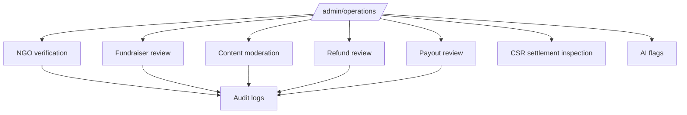

# Admin Operations

Admin operations keep the platform safe, accurate, and compliant. Admins should use admin pages and database RPCs instead of manual table edits.

## Routes

- `/admin/operations`
- `/admin/analytics`
- `/admin/audit`
- `/admin/ai-flags`
- `/admin/csr-settlements`
- `/admin/fundraisers`
- `/admin/moderation`
- `/admin/ngo-verifications`
- `/admin/payouts`
- `/admin/refunds`

## Admin Operations Hub

`/admin/operations` is the main entry point for review queues and operational tasks.

## NGO Verification

Admins review submitted NGO verifications. Decisions include:

- Request changes.
- Verify.
- Reject.
- Expire.

The workflow uses `review_ngo_verification`.

## Fundraiser Review

Admins review supporter fundraisers. This protects public fundraising quality and checks whether required evidence is present.

The workflow uses `transition_campaign`.

## Moderation

Admins review content reports and impact stories. The moderation system should not destroy audit history.

Important functions:

- `moderate_reported_content`
- `review_impact_story`

## Refunds

Admins review refund requests and reconcile PayPal refund completion.

Important functions:

- `review_refund_request`
- `complete_paypal_refund`

## Payouts

Admins review NGO payout accounts and reconcile payout transfers.

Important functions:

- `review_payout_account`
- `reconcile_paypal_payout_transfer`

## CSR Settlements

Admins can inspect CSR settlement records. Corporate users create settlements, but admins need visibility into settlement status and exceptions.

## AI Flags

AI helper flows can create flags for admin review. Admins inspect these in `/admin/ai-flags`.

## Audit Logs

`/admin/audit` reads `audit_logs`. Important decisions should leave an audit record.
