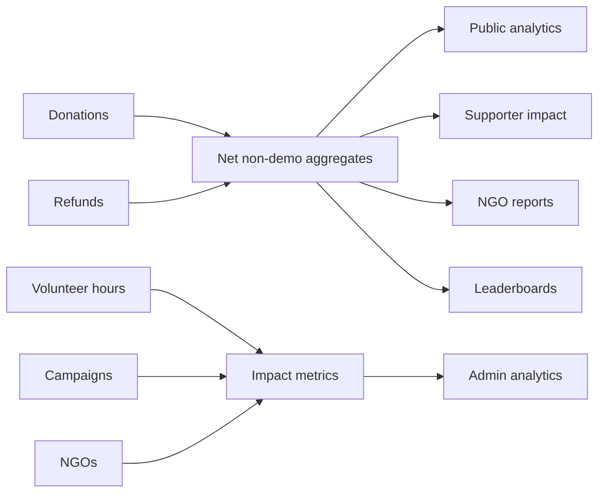

# Analytics, Reports, and Leaderboards

DaanSetu has public analytics, supporter analytics, NGO analytics, admin analytics, and public leaderboards.

## Routes

- `/analytics`
- `/dashboard/impact`
- `/ngo/dashboard/analytics`
- `/api/ngo/reports/impact`
- `/admin/analytics`
- `/leaderboard`

## Main Data Records

- `donations`
- `campaigns`
- `ngos`
- `volunteer_profiles`
- `volunteer_hours`
- `analytics_logs`
- `activity_logs`
- `user_badges`

## Public Analytics

Public analytics show platform-level impact. They should use public-safe, aggregate data.

Important rules:

- Exclude demo payments.
- Subtract refunded paise.
- Count only safe public records.
- Do not expose private donor emails.

## Supporter Impact

Supporter impact charts show a signed-in user's own giving and activity.

## NGO Analytics

NGO analytics summarize campaign donations, volunteer work, and impact outcomes for the NGO owner.

The impact report download route returns CSV from `/api/ngo/reports/impact`.

## Admin Analytics

Admin analytics give platform operators a broader view of:

- NGOs.
- Campaigns.
- Donations.
- Volunteers.
- AI flags.
- Growth and operational signals.

## Leaderboards

Leaderboards use `lib/services/leaderboard.ts`. They are server-only and avoid selecting account email fields.

Leaderboards can rank:

- Giving.
- Volunteer hours.
- User rank or public contribution stats.
