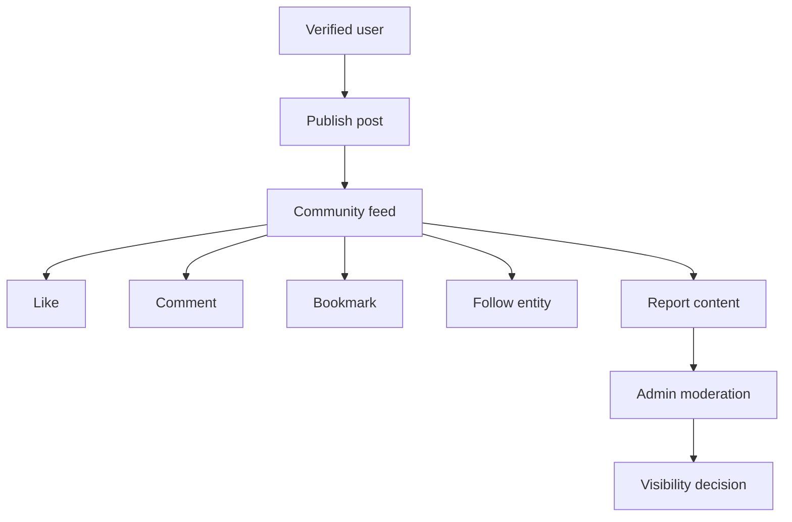

# Community and Social Features

The community area lets verified users share updates, interact with posts, follow entities, and report harmful content.

## Routes

- `/community`
- `/community/create`
- `/community/[id]`
- `/profile/[userId]`
- `/notifications`

## Main Data Records

- `posts`
- `post_likes`
- `post_comments`
- `post_bookmarks`
- `post_views`
- `follows`
- `content_reports`
- `moderation_actions`
- `notifications`
- `user_badges`

## Community Feed

`/community` lists visible posts. Feed components support filtering, trending posts, enhanced post cards, and create-post entry points.

## Publishing Posts

Verified users can publish posts from `/community/create`. The composer can upload images through `/api/upload/image`.

The upload route writes to the `community-media` bucket and does not allow arbitrary bucket selection.

## Interactions

Users can:

- Like posts.
- Comment on posts.
- Bookmark posts.
- Share posts.
- Report posts.
- Follow users, NGOs, or corporate profiles.

Most interactions are server actions in `app/community/actions.ts` or `app/follows/actions.ts`.

## Reports and Moderation

Users can report visible content. Admins review reports in `/admin/moderation`.

Admin moderation uses audited database functions such as:

- `moderate_reported_content`
- `review_impact_story`

The system should hide or restore content without erasing the audit history.

## Notifications

Post interactions can create notifications through database triggers such as `notify_post_interaction`.

## Badges

Badges are stored in `user_badges` and can be fetched through `/api/badges/[userId]`.
