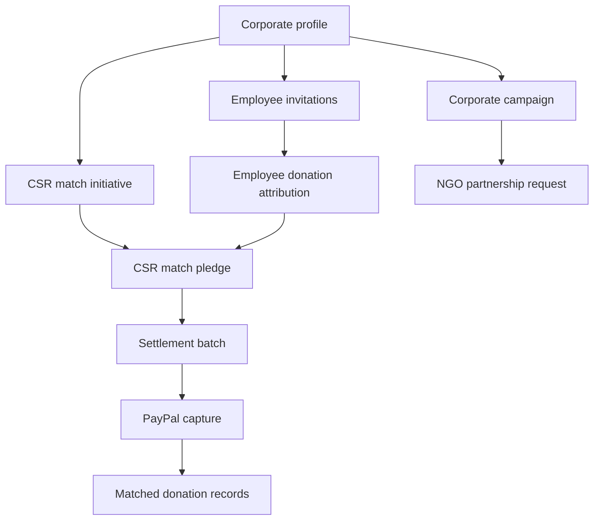

# Corporate CSR

The corporate CSR area lets companies create CSR profiles, invite employees, run corporate campaigns, create matching initiatives, partner with NGOs, and settle matched pledges.

## Routes

- `/corporate/profile`
- `/corporate/dashboard`
- `/corporate/employees`
- `/corporate/invitations/[token]`
- `/corporate/campaigns`
- `/corporate/campaigns/create`
- `/corporate/campaigns/[id]`
- `/corporate/settlements`
- `/corporate/settlements/paypal-return`
- `/corporate/settlements/paypal-cancel`
- `/csr-campaigns`
- `/admin/csr-settlements`

## Main Data Records

- `corporate_profiles`
- `corporate_employees`
- `corporate_invitations`
- `corporate_campaigns`
- `partnership_requests`
- `csr_initiatives`
- `csr_match_pledges`
- `csr_settlements`
- `csr_settlement_pledges`
- `donations`
- `audit_logs`
- `notifications`

## Corporate Profile

Corporate users create a company profile with business identity and CSR details. The dashboard uses that profile to scope campaigns, employees, and settlements.

## Employee Invitations

Corporate users can invite employees. Invitations are created with `create_corporate_invitation` and accepted with `accept_corporate_invitation`.

Employee attribution connects supporter donations to corporate programs where applicable.

## Corporate Campaigns

Corporate campaigns hold public CSR campaign information and goals. Money fields use integer paise.

## Partnership Requests

Corporate users can request partnerships with verified NGOs. NGOs and corporates can view the requests relevant to them.

Review decisions use `review_partnership_request` so the result is transactional and notification-aware.

## CSR Match Initiatives

CSR initiatives define matching rules and caps. They are used to create match pledges when employee-attributed donations qualify.

## Settlements

`/corporate/settlements` lets corporate users collect outstanding match pledges into a settlement batch.

The payment flow:

1. Corporate user selects eligible outstanding pledges.
2. `/api/csr/settlements` creates a settlement batch and PayPal order.
3. PayPal redirects to `/corporate/settlements/paypal-return`.
4. The return page sends a same-origin POST to `/api/csr/settlements/capture`.
5. The server captures the PayPal order.
6. The database allocates matched donations and marks settlement records.

Capture is rate-limited and same-origin checked.

## Cancellations and Reversals

If a settlement is cancelled or reversed, the system should release or reverse related pledges using functions such as:

- `cancel_csr_settlement`
- `reverse_csr_settlement`
