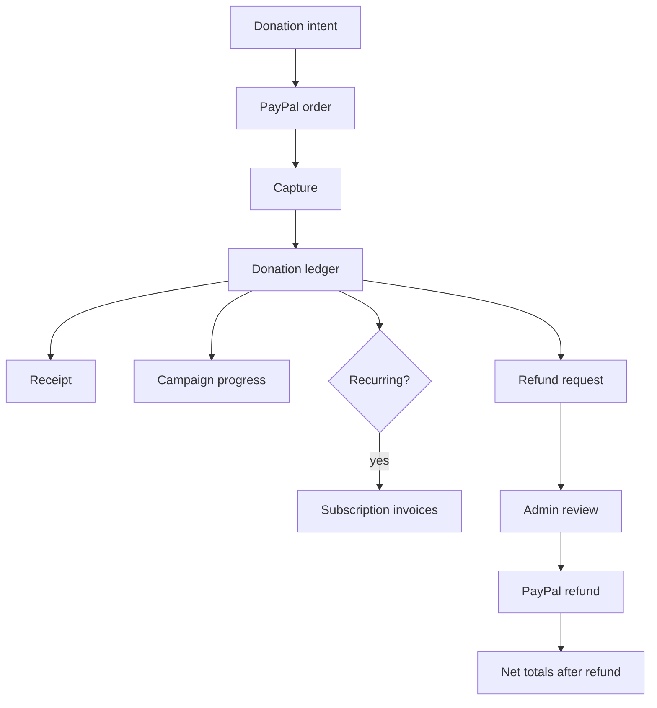

# Donations, Payments, Subscriptions, Refunds, and Receipts

Financial flows are one of the most sensitive parts of DaanSetu. The app uses PayPal for provider-backed payment actions and stores application money values as integer paise.

## Routes

- `/dashboard/giving`
- `/donation/paypal-return`
- `/api/payment/create-order`
- `/api/payment/capture`
- `/api/payment/webhook`
- `/api/payment/subscriptions`
- `/api/demo/payments`
- `/api/receipts/[id]`
- `/admin/refunds`

## Main Data Records

- `payment_orders`
- `payment_events`
- `donations`
- `subscriptions`
- `subscription_invoices`
- `refund_requests`
- `tax_certificates`
- `audit_logs`
- `notifications`

## One-Time Donation Flow

1. A user starts a donation from a campaign page.
2. The server validates the campaign and amount.
3. `/api/payment/create-order` creates a PayPal order.
4. The app stores a `payment_orders` record.
5. PayPal redirects the user back.
6. `/api/payment/capture` captures the order.
7. The server verifies the provider amount.
8. A database RPC records the completed payment.
9. Donation, campaign progress, receipts, notifications, and related records are updated.

## Webhooks

`/api/payment/webhook` receives PayPal events.

Webhook handling is idempotent. Events are stored in `payment_events` using provider event identifiers so duplicates do not double-count money.

Webhook responsibilities include:

- Completed order reconciliation.
- Refund completion.
- Payment reversal handling.
- Subscription reconciliation.
- Subscription invoice recording.
- Payout transfer reconciliation.
- CSR settlement reversal where needed.

## Subscriptions

Subscriptions use PayPal plan IDs and server-configured plan amounts.

Important environment variables:

- `PAYPAL_PLAN_MONTHLY`
- `PAYPAL_PLAN_MONTHLY_AMOUNT_PAISE`
- `PAYPAL_PLAN_QUARTERLY`
- `PAYPAL_PLAN_QUARTERLY_AMOUNT_PAISE`
- `PAYPAL_PLAN_YEARLY`
- `PAYPAL_PLAN_YEARLY_AMOUNT_PAISE`

The API rejects mismatched recurring gift amounts. This prevents a client from selecting a PayPal plan but reporting a different application amount.

## Demo Payments

`/api/demo/payments` exists only for local or controlled demos.

Rules:

- It is unavailable in production.
- It requires an authenticated and email-verified user.
- It marks records with `is_demo=true`.
- It uses the same atomic donation-recording path as captured payments.
- It must not be used as a provider fallback.
- Demo donations are excluded from public impact and campaign totals.

## Refund Requests

Supporters request refunds from `/dashboard/giving`.

Admins review refunds from `/admin/refunds`.

Refund review and completion use database RPCs such as:

- `review_refund_request`
- `complete_paypal_refund`

Refunded paise must reduce supporter and public financial aggregates.

## Receipts

`/api/receipts/[id]` returns receipts for allowed users. Receipts are app-level proof of a donation record.

Important distinction:

- A receipt confirms the donation record.
- Form 10BE is a statutory certificate handled separately.
