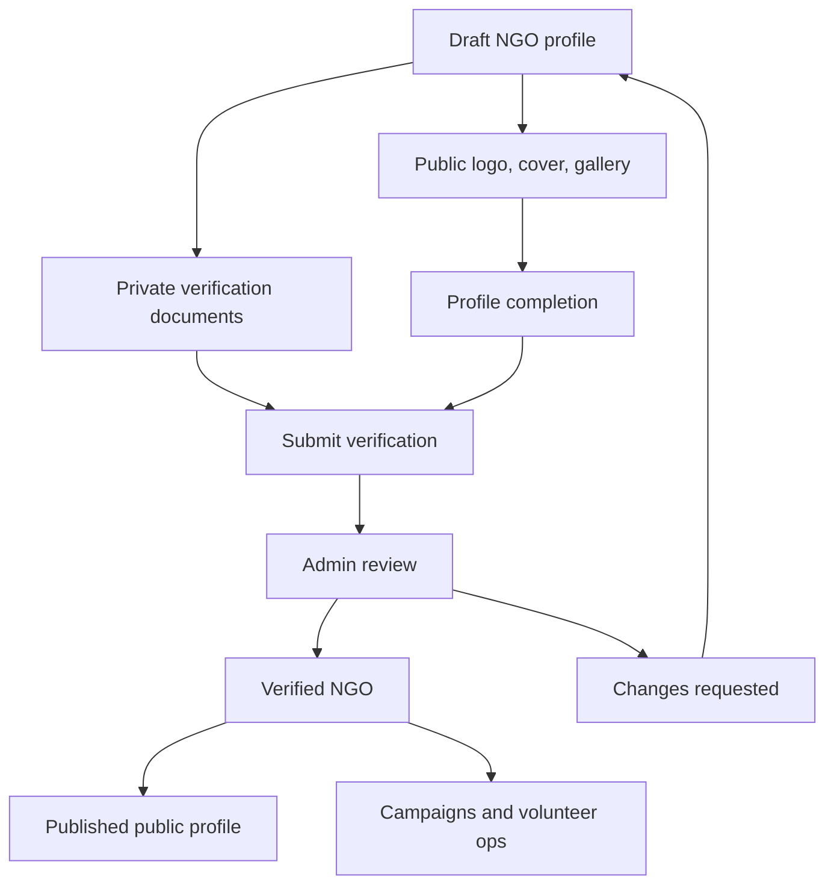

# NGO Onboarding, Profile, and Verification

The NGO feature set lets an NGO build a public profile, submit verification documents, wait for admin review, and operate campaigns and volunteer programs after setup.

## Routes

- `/ngo/profile`
- `/ngos/[id]`
- `/admin/ngo-verifications`

## Main Data Records

- `ngos`
- `ngo_verifications`
- `ngo_verification_documents`
- `ngo_programs`
- `ngo_updates`
- `ngo_gallery_images`
- `ngo_service_areas`
- `audit_logs`
- `notifications`

## NGO Profile Sections

The profile form collects:

- Legal name.
- Display name.
- Tagline.
- Description.
- Mission.
- Founding year.
- Organization type.
- Address and location.
- Primary cause.
- Impact areas.
- Beneficiary groups.
- Program summary.
- Vision.
- Theory of change.
- Core values.
- Operating states.
- Team size.
- Beneficiaries reached.
- Communities served.
- Volunteers engaged.
- Website.
- Public email.
- Public phone.
- Social links.
- Discoverability settings.
- Donation and volunteer settings.

## Profile Completion

`lib/ngo/profile.ts` calculates profile completion by section. Completion is separate from publication. An NGO may save drafts while incomplete.

Publishing requires the core public sections to be valid. Negative impact metrics are rejected.

## Profile Visibility

Profile visibility has two separate ideas:

- Can the profile be opened directly?
- Should the profile appear in discovery?

A published but non-discoverable profile can be available by direct link while staying out of directory listings.

## Verification Documents

NGO verification documents are private files. Supported uploads are:

- PDF
- JPEG
- PNG

Maximum size is 10 MB per document.

Documents are stored in the private `ngo-verification` bucket and tracked in `ngo_verification_documents`.

## Verification State Machine

Verification can move through:

- `draft`
- `submitted`
- `changes_requested`
- `verified`
- `rejected`
- `expired`

NGO users can revise editable states such as drafts, changes requested, and rejected records. Admin review uses database RPCs so important decisions are atomic, audited, and notification-producing.

## Admin Review

Admins use `/admin/ngo-verifications`.

Admin decisions can:

- Verify an NGO.
- Reject an NGO.
- Request changes.
- Expire a verification.

The review flow writes audit logs and notifications. Admins should not manually edit verification rows unless debugging a controlled development environment.

## Public NGO Profile Content

Published NGO profiles can include:

- Programs.
- Updates.
- Gallery images.
- Service areas.
- Campaigns.
- Volunteer opportunities.
- Reviews.

Program, update, gallery, and service-area records are dashboard-managed public content.
