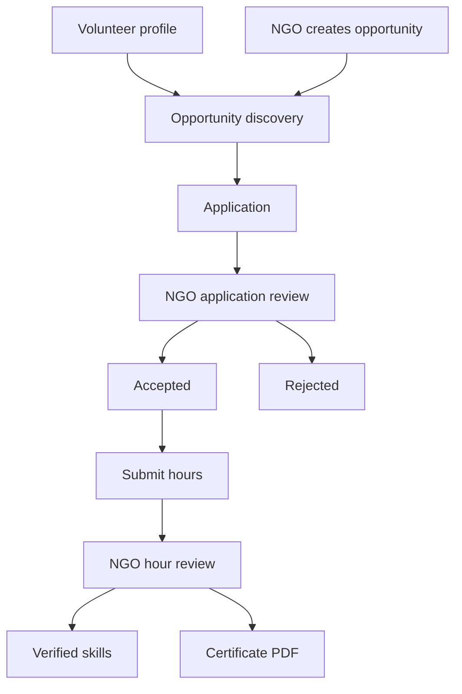

# Volunteering

Volunteering supports public opportunity discovery, volunteer profiles, applications, hour submission, NGO review, skill verification, and downloadable certificates.

## Routes

- `/volunteer/profile`
- `/volunteer/opportunities`
- `/volunteer/dashboard`
- `/ngo/dashboard/volunteers`
- `/api/volunteer-certificates/[id]`

## Main Data Records

- `volunteer_profiles`
- `volunteer_opportunities`
- `volunteer_applications`
- `volunteer_hours`
- `skill_verifications`
- `volunteer_certificates`
- `notifications`

## Volunteer Profile

Volunteers can save profile information such as:

- City.
- Skills.
- Availability.
- Interests.
- Contact or participation details.

The profile helps match users to opportunities.

## Opportunity Discovery

`/volunteer/opportunities` is server-driven, filterable, paginated, and actionable. Users can filter by required skills, city, and other opportunity fields.

## Applying

Authenticated users can apply to active opportunities. Applications are stored in `volunteer_applications`.

Users can also withdraw their own applications.

## Submitting Hours

Volunteers submit service hours after participating. Hours are reviewed by NGO owners.

## NGO Review

NGO users manage volunteer work from `/ngo/dashboard/volunteers`.

They can:

- Create volunteer opportunities.
- Review applications.
- Approve or reject applications.
- Review submitted hours.
- Update opportunity status.

Review actions use validated server actions and database RPCs such as:

- `review_volunteer_application`
- `review_volunteer_hours`

## Skill Verification and Certificates

Approved hours can produce verified skills and volunteer certificates.

`/api/volunteer-certificates/[id]` returns a deterministic PDF certificate only to allowed participants.

Certificates include:

- Certificate number.
- Volunteer name.
- NGO name.
- Opportunity title.
- Approved hours.
- Issue date.
