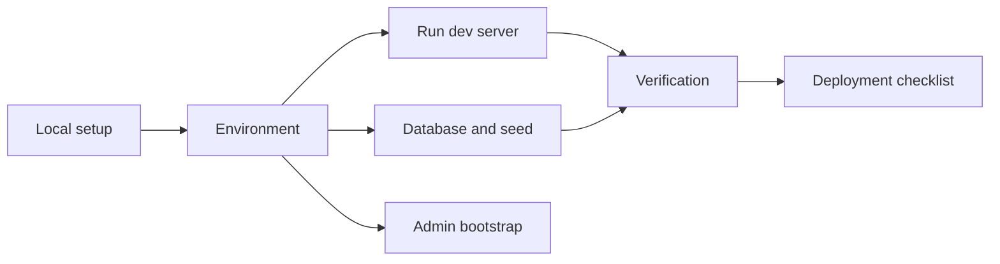

# Operations Index

Operations docs explain how to run, verify, seed, deploy, and administer the project.

- [Local development](local-development.md)
- [Environment variables](environment-variables.md)
- [Database and seed data](database-and-seed-data.md)
- [Verification](verification.md)
- [Deployment checklist](deployment-checklist.md)
- [Admin bootstrap](admin-bootstrap.md)
