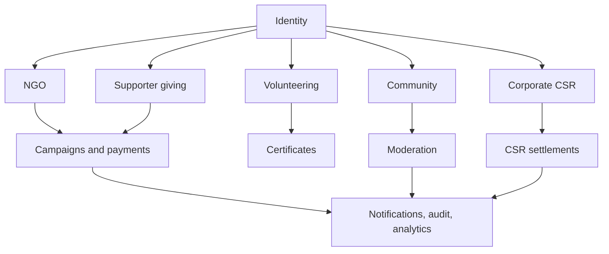

# Data Model Reference

This is a practical reference for the main database tables.

## Identity

- `users` - core public account record and role.
- `user_profiles` - richer public user profile.
- `donor_tax_profiles` - donor tax information.

## NGO

- `ngos` - NGO profile and public settings.
- `ngo_verifications` - verification state.
- `ngo_verification_documents` - private document metadata.
- `ngo_programs` - public programs.
- `ngo_updates` - NGO public updates.
- `ngo_gallery_images` - public gallery images.
- `ngo_service_areas` - service-area details.
- `ngo_reviews` - public review records.

## Campaigns and Payments

- `campaigns` - fundraising campaigns.
- `campaign_updates` - campaign updates.
- `campaign_milestones` - campaign milestone targets.
- `donations` - donation ledger.
- `payment_orders` - provider order records.
- `payment_events` - webhook event records.
- `subscriptions` - recurring gift subscriptions.
- `subscription_invoices` - subscription payment invoices.
- `refund_requests` - refund workflow records.
- `payment_transfers` - payout transfer records.
- `payout_accounts` - NGO payout account records.
- `tax_certificates` - official tax certificate mappings.

## Volunteering

- `volunteer_profiles`
- `volunteer_opportunities`
- `volunteer_applications`
- `volunteer_hours`
- `skill_verifications`
- `volunteer_certificates`

## Community

- `posts`
- `post_likes`
- `post_comments`
- `post_bookmarks`
- `post_views`
- `follows`
- `content_reports`
- `moderation_actions`
- `user_badges`

## Corporate CSR

- `corporate_profiles`
- `corporate_employees`
- `corporate_invitations`
- `corporate_campaigns`
- `partnership_requests`
- `csr_initiatives`
- `csr_match_pledges`
- `csr_settlements`
- `csr_settlement_pledges`

## Operations

- `notifications`
- `activity_logs`
- `analytics_logs`
- `audit_logs`
- `ai_flags`
- `action_rate_limits`
- `email_queue`
