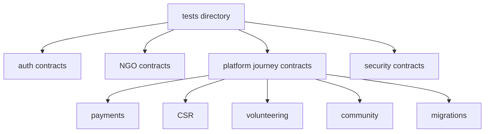

# Testing Reference

Tests use Node's built-in test runner.



## Commands

```bash
npm test
npm run test:coverage
```

## Test Folders

- `tests/auth`
- `tests/ngo`
- `tests/platform`
- `tests/security`

## Test Style

Many tests are contract tests. They check that important files, migrations, RPCs, and route boundaries still exist and still enforce expected rules.

This style is useful for DaanSetu because important behavior crosses several layers:

- Page.
- Server action.
- Route handler.
- Migration.
- RLS.
- RPC.
- Storage policy.

## When to Add Tests

Add or update tests when changing:

- Auth validation or redirects.
- NGO verification.
- Campaign lifecycle.
- Payment or webhook behavior.
- Refunds or payouts.
- Tax documents.
- Volunteer workflows.
- Community moderation.
- CSR settlement.
- Admin decision RPCs.
- Security headers.
- Database migrations.
