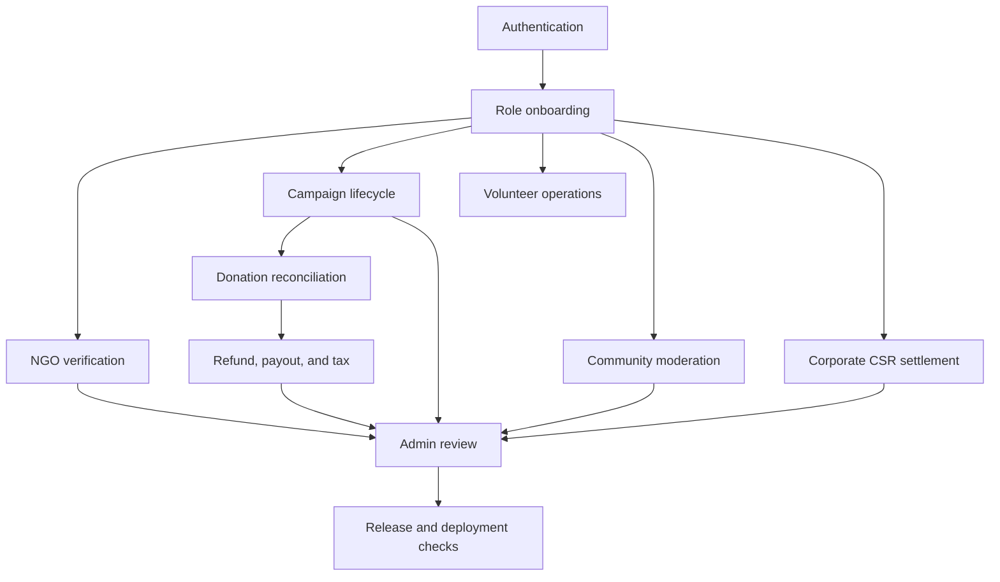

# Workflow Index

Workflow docs explain how records move through the system. Use them when you need to understand the order of actions, who can do what, and which parts must be atomic.

- [Authentication and onboarding](authentication-onboarding.md)
- [NGO verification](ngo-verification.md)
- [Campaign lifecycle](campaign-lifecycle.md)
- [Donation and payment reconciliation](donation-payment-reconciliation.md)
- [Refund, payout, and tax](refund-payout-tax.md)
- [Volunteer operations](volunteer-operations.md)
- [Community moderation](community-moderation.md)
- [Corporate CSR settlement](corporate-csr-settlement.md)
- [Admin review](admin-review.md)
- [Release and deployment](release-deployment.md)
