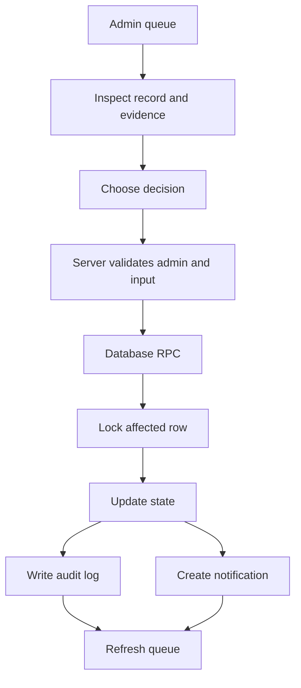

# Admin Review Workflow

Admin review workflows should be consistent across the app: validate input, lock the record where needed, update state atomically, write audit history, and notify the affected user.

## Common Review Pattern

1. Admin opens the relevant admin page.
2. Admin reviews the record and supporting evidence.
3. Admin chooses a decision.
4. Server action validates admin role.
5. Server action validates decision input.
6. Database RPC applies the state change.
7. RPC writes audit log.
8. RPC creates notification when useful.
9. UI refreshes the queue.

## Review Queues

| Queue                     | Route                      | Main RPC                           |
| ------------------------- | -------------------------- | ---------------------------------- |
| NGO verification          | `/admin/ngo-verifications` | `review_ngo_verification`          |
| Fundraisers               | `/admin/fundraisers`       | `transition_campaign`              |
| Content reports           | `/admin/moderation`        | `moderate_reported_content`        |
| Impact stories            | `/admin/moderation`        | `review_impact_story`              |
| Refunds                   | `/admin/refunds`           | `review_refund_request`            |
| Payout accounts           | `/admin/payouts`           | `review_payout_account`            |
| Payout transfers          | `/admin/payouts`           | `reconcile_paypal_payout_transfer` |
| CSR settlement inspection | `/admin/csr-settlements`   | Read and investigate               |

## Why RPCs Matter

RPCs keep important changes in one database transaction. This avoids partial state like:

- Status changed but no audit log.
- Refund approved but user not notified.
- Verification changed but NGO trust state not updated.
- Moderation action written but post visibility unchanged.

## Admin Rules

- Do not approve your own unsupported records manually.
- Do not bypass review actions unless debugging development data.
- Keep decision reasons clear.
- Prefer reversible moderation states over deletion.
- Confirm provider data before financial decisions.
