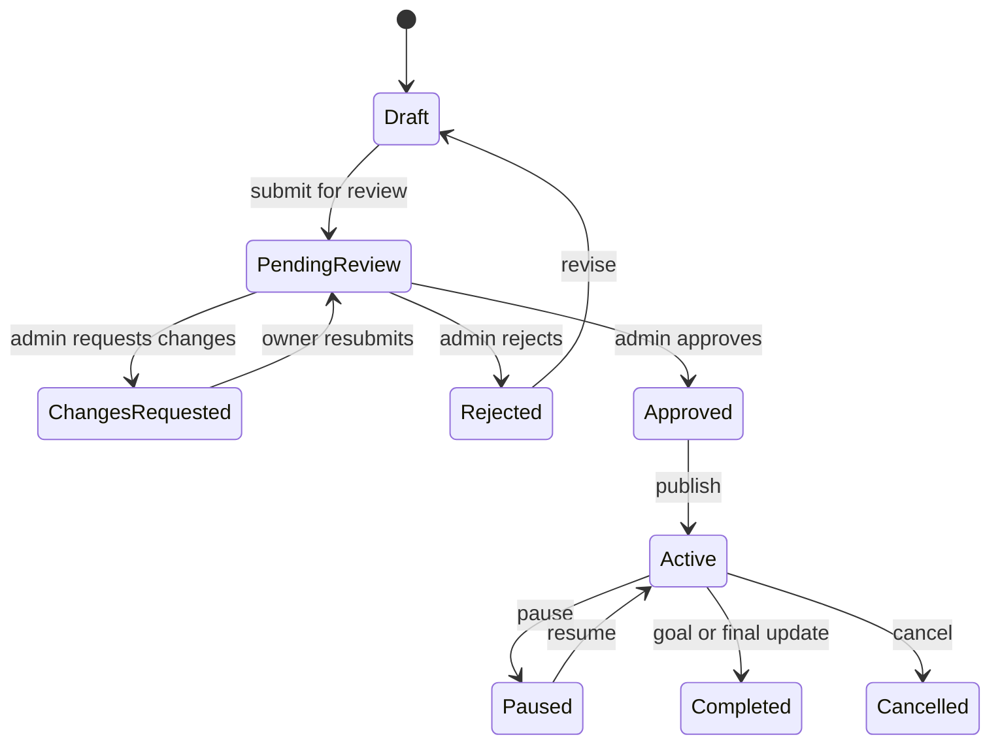

# Campaign Lifecycle Workflow

Campaigns move from draft to public fundraising through owner actions and admin decisions.

## Actors

- NGO owner or supporter fundraiser creator.
- Admin.
- Supporter donor.
- Payment provider.

## Common States

- Draft.
- Pending review.
- Changes requested.
- Rejected.
- Approved.
- Active.
- Paused.
- Completed.
- Cancelled.

## Campaign Creation

1. Creator opens `/campaigns/create`.
2. Creator enters title, story, category, goal, deadline, and related details.
3. Server validates the input.
4. Campaign is saved in `campaigns`.
5. If evidence is uploaded, files are encrypted and stored privately.

## Draft Management

1. Owner opens `/campaigns/[id]/manage`.
2. Owner edits campaign details.
3. Owner adds or removes milestones.
4. Owner uploads evidence.
5. Server actions validate ownership.
6. Draft updates are saved.

## Review

1. Owner requests review or transition.
2. Admin opens `/admin/fundraisers` for supporter fundraisers or relevant admin surface.
3. Admin approves, rejects, or requests changes.
4. `transition_campaign` updates state atomically.
5. Owner receives notification.
6. Audit log is written.

## Active Fundraising

When active:

- Campaign can appear in `/campaigns`.
- Campaign detail page can accept donations.
- Public progress can update from captured non-demo donations.
- Updates can be published.

## Milestones

1. Owner creates milestones with paise targets.
2. Donations increase progress.
3. Database function can detect achieved milestones.
4. Notifications can be created.

## Campaign Updates

1. Owner opens `/campaigns/[id]/updates`.
2. Owner submits update text and optional image.
3. Server validates ownership.
4. `campaign_updates` receives the update.
5. Public users can read active campaign updates.

## Completion

A campaign may be completed when:

- Goal is reached.
- Deadline ends and owner/admin marks it complete.
- Admin or owner uses an allowed transition.

Cancelled campaigns should not accept new donations.
