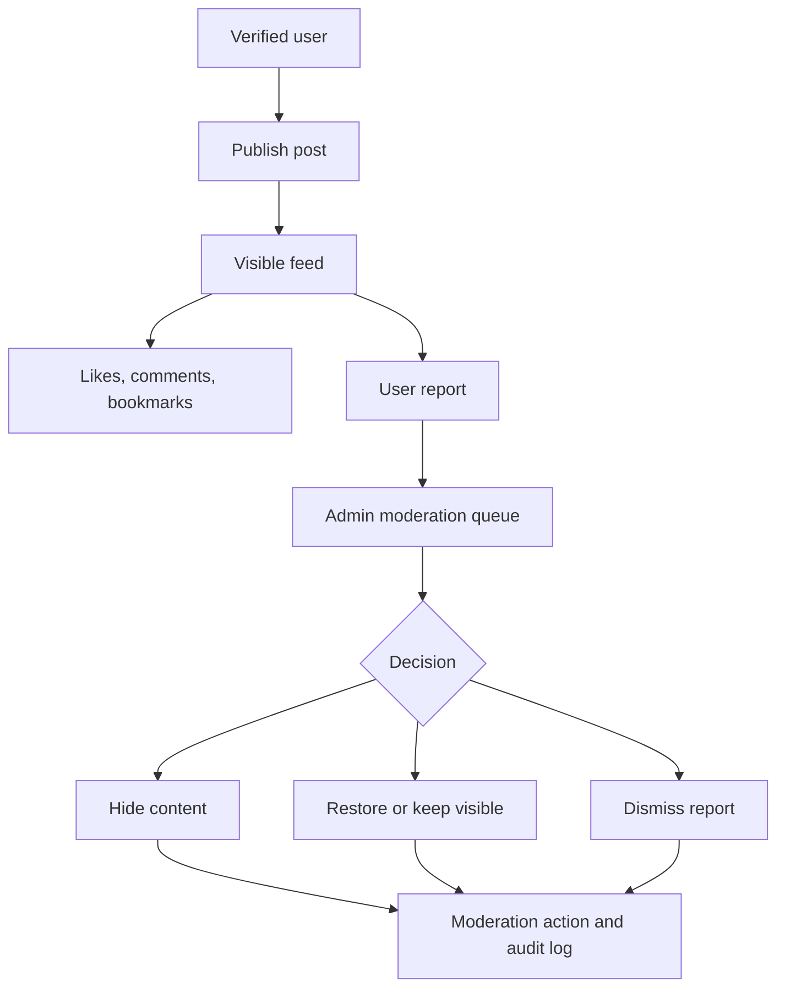

# Community Moderation Workflow

Community moderation keeps public discussion usable while preserving audit history.

## Publishing

1. Verified user opens `/community/create`.
2. User writes post and optionally uploads media.
3. Media upload goes through `/api/upload/image`.
4. Server stores file in `community-media`.
5. Server action inserts `posts`.
6. Post appears if visible and allowed by RLS.

## Interaction

Users can:

- Like.
- Comment.
- Bookmark.
- Share.
- Follow.
- Report.

Interactions use server actions and database rules. Notifications may be created by triggers.

## Reporting

1. User reports visible content.
2. Server inserts `content_reports`.
3. Duplicate report constraints prevent report spam.
4. Admin sees reports in `/admin/moderation`.

## Admin Moderation

1. Admin reviews report.
2. Admin chooses action.
3. Server action calls `moderate_reported_content`.
4. Database updates content visibility or report status.
5. `moderation_actions` receives a record.
6. `audit_logs` receives a record.
7. Affected users can be notified.

## Impact Story Review

Admins can also review impact-story visibility with `review_impact_story`.

## Rules

- Moderation should hide or restore content, not erase history casually.
- Admin actions must be auditable.
- Users should not be able to write moderation-only fields.
- Verified-user checks protect publishing.
