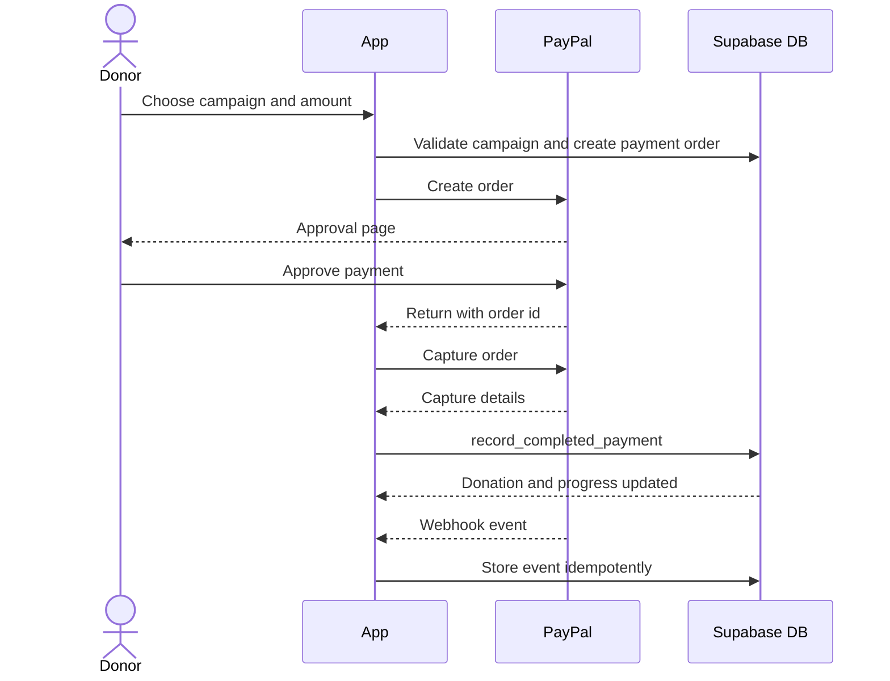

# Donation and Payment Reconciliation Workflow

This workflow describes how money moves from user intent to recorded donation.

## One-Time Donation

1. User chooses an amount on a campaign.
2. Browser calls `/api/payment/create-order`.
3. Server validates session, campaign, amount, and optional attribution.
4. Server creates a PayPal order.
5. Server stores a `payment_orders` row.
6. User completes PayPal approval.
7. PayPal returns user to the app.
8. Browser or return page calls `/api/payment/capture`.
9. Server captures the PayPal order.
10. Server validates provider amount and currency.
11. Server calls `record_completed_payment`.
12. Database creates or updates donation records.
13. Campaign progress, notifications, and related records are updated.

## Webhook Reconciliation

1. PayPal sends an event to `/api/payment/webhook`.
2. Server verifies the webhook.
3. Event ID is inserted into `payment_events`.
4. Duplicate events are ignored.
5. Event type decides the reconciliation path.
6. Database RPC updates the correct records.

## Subscription Donation

1. User selects a configured interval.
2. Server checks plan ID and expected paise amount.
3. PayPal subscription is created.
4. `subscriptions` row is inserted.
5. Webhooks reconcile subscription payments into invoices and donation records.

## Demo Payment

1. User triggers demo payment in non-production.
2. `/api/demo/payments` checks auth and email verification.
3. Demo payment is recorded with `is_demo=true`.
4. It follows the atomic donation path.
5. It is excluded from real campaign and public impact totals.

## Reversal

If PayPal reports reversal or dispute-like events:

1. Webhook stores the event.
2. Server finds the donation or settlement.
3. Database function reverses the captured value.
4. Related financial totals are corrected.

## Rules

- Provider IDs must be unique.
- Webhooks must be idempotent.
- Client-reported amounts are never enough by themselves.
- Application money is integer paise.
- Provider settlement fields can store provider currency and minor units separately.
