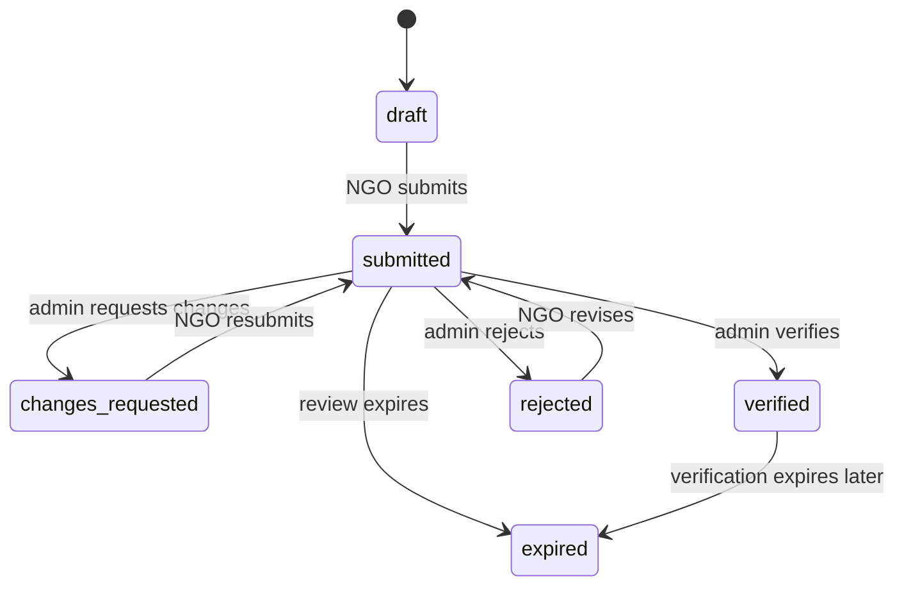

# NGO Verification Workflow

NGO verification makes sure public NGOs are reviewed before they receive trusted status.

## Actors

- NGO owner.
- Admin.
- Supabase database.
- Private storage bucket.

## States

- `draft`
- `submitted`
- `changes_requested`
- `verified`
- `rejected`
- `expired`

## NGO Drafting

1. NGO user signs up or signs in.
2. User opens `/ngo/profile`.
3. User fills the public profile sections.
4. User uploads public assets like logo and cover.
5. User uploads private verification documents.
6. The app stores profile data in `ngos`.
7. Verification data is stored in `ngo_verifications`.
8. Documents are stored privately and tracked in `ngo_verification_documents`.

## Submission

1. NGO user checks the profile and documents.
2. User submits verification.
3. Server action calls `submit_ngo_verification`.
4. Database locks and updates the verification record.
5. Admin notification and audit records are created where required.

## Admin Review

1. Admin opens `/admin/ngo-verifications`.
2. Admin reviews profile and documents.
3. Admin chooses a decision.
4. Server action calls `review_ngo_verification`.
5. Database updates verification state.
6. Related NGO trust fields are updated.
7. Audit log is written.
8. NGO owner receives a notification.

## Changes Requested

1. Admin chooses changes requested.
2. NGO receives a notification.
3. NGO edits the profile or documents.
4. NGO resubmits.

## Verified

When verified:

- The NGO can appear as verified.
- Campaign and volunteer workflows can use verified status where required.
- Public trust indicators can be shown.

## Important Rules

- NGO users cannot verify themselves.
- Private documents must not be exposed as public URLs.
- Review decisions should go through RPCs, not direct table updates.
- Review history should remain auditable.
