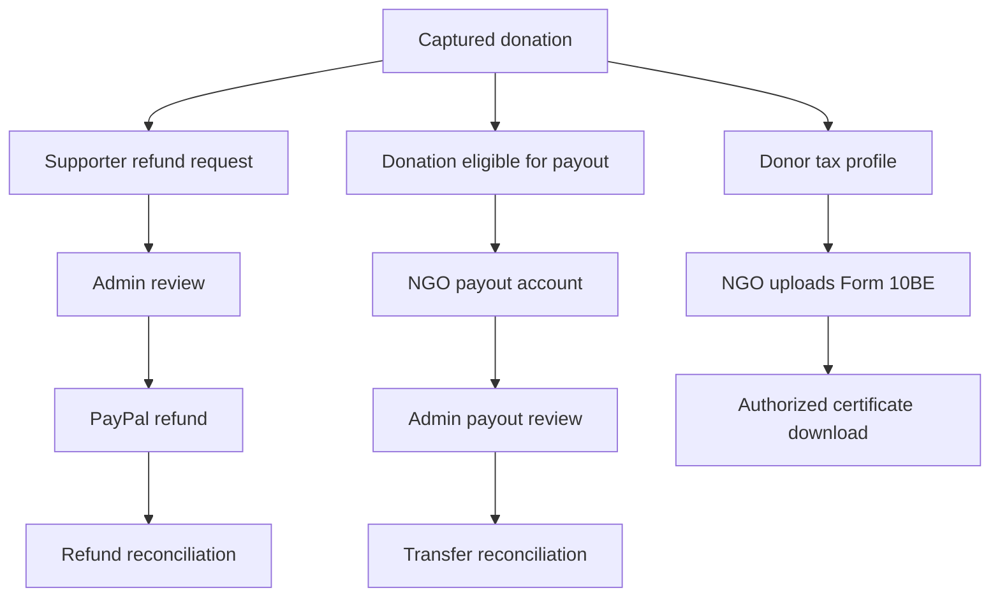

# Refund, Payout, and Tax Workflow

Refunds, payouts, and tax documents are separate but related financial operations.

## Refund Request

1. Supporter opens `/dashboard/giving`.
2. Supporter requests a refund for an eligible donation.
3. Server inserts a `refund_requests` row.
4. Admin reviews the request in `/admin/refunds`.
5. Admin calls `review_refund_request`.
6. If approved, provider refund is created or reconciled.
7. `complete_paypal_refund` marks the refund complete.
8. Donation `refunded_paise` is updated.
9. Notifications and audit logs are written.

## Payout Account Submission

1. NGO opens `/ngo/dashboard/payouts`.
2. NGO submits payout recipient details.
3. Server stores a `payout_accounts` row.
4. Admin reviews in `/admin/payouts`.
5. Admin calls `review_payout_account`.
6. NGO receives a notification.

## Payout Transfer Reconciliation

1. Eligible captured donations are ready for payout.
2. Admin initiates or records payout action.
3. PayPal payout transfer details are reconciled with `reconcile_paypal_payout_transfer`.
4. `payment_transfers` records provider batch and item identifiers.
5. Audit logs are written.

## Donor Tax Profile

1. Supporter opens `/dashboard/giving`.
2. Supporter enters tax profile data.
3. Server stores data in `donor_tax_profiles`.
4. Sensitive values are protected by database and app-level rules.

## NGO Form 10BE Upload

1. NGO opens `/ngo/dashboard/tax`.
2. NGO uploads official Form 10BE mapping.
3. File is encrypted.
4. File is stored in private `tax-certificates` storage.
5. Metadata is recorded in `tax_certificates`.
6. Authorized users can download through `/api/tax-certificates/[id]`.

## Form 10BD Export

NGOs can use `/ngo/dashboard/tax/10bd` for Form 10BD-related export support.

## Important Rules

- Donation receipts are not statutory certificates.
- Form 10BE must be treated as an official uploaded document.
- Private tax files must not use public URLs.
- Refunds must reduce net donation totals.
- Payout records must keep provider identifiers for reconciliation.
